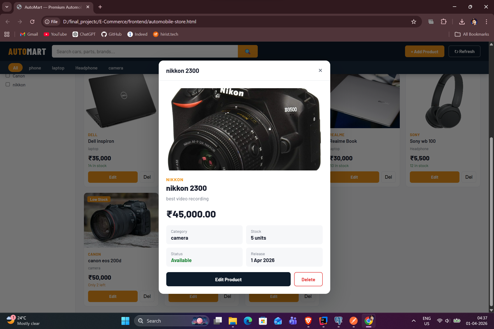

🚗 AutoMart — Automobile E-Commerce Store
A full-stack Spring Boot + HTML/CSS/JS e-commerce web application for managing and browsing automobile products. Built with a RESTful backend API and a Flipkart/Amazon-inspired frontend UI.

📸 Screenshots
Product Listing Page

Product view Page

🛠️ Tech Stack
LayerTechnologyBackendJava 17, Spring Boot 3.xORMSpring Data JPA / HibernateDatabaseMySQL / PostgreSQLBuild ToolMavenFrontendHTML5, CSS3, Vanilla JavaScriptStylingCustom CSS (Flipkart/Amazon inspired)Image StorageBinary (stored in DB as byte[])

✨ Features

📦 Full CRUD — Create, Read, Update, Delete products
🖼️ Image Upload — Upload and display product images stored in the database
🔍 Live Search — Search products by name, brand, category, or description
🗂️ Category Filter — Filter products by category via nav pills
💰 Price Filter — Filter products by min/max price range
🏷️ Brand Filter — Checkbox-based brand filtering in sidebar
📊 Sorting — Sort by price (low/high), name, or stock quantity
✅ Stock Badges — In Stock / Low Stock / Out of Stock indicators
📱 Responsive UI — Mobile-friendly layout
🔔 Toast Notifications — Success/error feedback for every operation
💀 Skeleton Loading — Shimmer loading animation while fetching data

📁 Project Structure
Automobile/
├── src/
│   └── main/
│       ├── java/com/example/Automobile/
│       │   ├── controller/
│       │   │   └── ProductController.java     # REST API endpoints
│       │   ├── model/
│       │   │   └── Product.java               # JPA entity
│       │   ├── repository/
│       │   │   └── ProductRepository.java     # Spring Data JPA repo
│       │   ├── service/
│       │   │   └── ProductService.java        # Business logic
│       │   └── AutomobileApplication.java     # Main entry point
│       └── resources/
│           └── application.properties         # DB config
├── frontend/
│   └── automobile-store.html                  # Full frontend (single file)
├── ss1.png                                    # Screenshot 1
├── ss2.png                                    # Screenshot 2
├── pom.xml
└── README.md

🚀 Getting Started
Prerequisites

Java 17+
Maven 3.6+
MySQL or PostgreSQL running locally
Any modern browser (Chrome, Edge, Firefox)

1. Clone the Repository
bashgit clone https://github.com/your-username/automobile-ecommerce.git
cd automobile-ecommerce

2. Configure the Database
Edit src/main/resources/application.properties:
propertiesspring.datasource.url=jdbc:mysql://localhost:3306/automobile_db
spring.datasource.username=root
spring.datasource.password=yourpassword
spring.datasource.driver-class-name=com.mysql.cj.jdbc.Driver

spring.jpa.hibernate.ddl-auto=update
spring.jpa.show-sql=true
spring.jpa.properties.hibernate.dialect=org.hibernate.dialect.MySQL8Dialect

spring.servlet.multipart.max-file-size=10MB
spring.servlet.multipart.max-request-size=10MB

Create the database first:
sqlCREATE DATABASE automobile_db;

3. Run the Backend
bashmvn spring-boot:run
The API will start at: http://localhost:8080

4. Open the Frontend
Open frontend/automobile-store.html directly in your browser:

Double-click the file, or
Use VS Code Live Server extension → Right-click → Open with Live Server

⚠️ Do not open it inside the claude.ai preview — it cannot connect to localhost from that sandbox.

📡 API Endpoints
Base URL: http://localhost:8080/api
MethodEndpointDescriptionGET/productsGet all productsGET/products/{id}Get product by IDPOST/productsAdd a new product (multipart)PUT/products/{id}Update product (multipart)DELETE/products/{id}Delete productGET/products/{id}/imageGet product image bytes
Sample POST Request (multipart/form-data)
POST /api/products
Content-Type: multipart/form-data

Part "p"         → application/json  → { "name": "Brake Pad", "Brand": "Bosch", ... }
Part "imageFile" → image/jpeg        → <binary image data>

🗄️ Product Model
java@Entity
public class Product {
    @Id
    @GeneratedValue(strategy = GenerationType.IDENTITY)
    private Integer id;          // Use Integer (not int) to allow null on create

    private String name;
    private String description;
    private String Brand;        // Capital B — matches JSON field name
    private BigDecimal price;
    private String category;
    private Date releaseDate;
    private int quantity;
    private boolean available;
    private String imagename;
    private String imagetype;

    @Lob
    private byte[] imagedate;    // Binary image stored in DB
}

Important: Use Integer (wrapper type) for id instead of primitive int to prevent Jackson null deserialization errors when creating new products.

⚙️ CORS Configuration
The controller is annotated with:
java@CrossOrigin(origins = "*", allowedHeaders = "*",
    methods = {RequestMethod.GET, RequestMethod.POST,
               RequestMethod.PUT, RequestMethod.DELETE})
@RestController
@RequestMapping("/api")
public class ProductController { ... }
This allows the frontend (running on any origin including file://) to communicate with the backend.

🐛 Common Issues & Fixes
ErrorCauseFixCannot map 'null' into type 'int'id field is primitive intChange to Integer in Product.javaCORS error in browser consoleMissing CORS annotationAdd @CrossOrigin(origins = "*") to controller415 Unsupported Media TypeMissing consumes on endpointAdd consumes = MediaType.MULTIPART_FORM_DATA_VALUELoading products... never loadsFrontend opened inside sandboxOpen automobile-store.html from file:// or Live ServerImage not showingimagename is nullEnsure image is uploaded and stored correctly

📦 Dependencies (pom.xml)
xml<dependencies>
    <dependency>
        <groupId>org.springframework.boot</groupId>
        <artifactId>spring-boot-starter-web</artifactId>
    </dependency>
    <dependency>
        <groupId>org.springframework.boot</groupId>
        <artifactId>spring-boot-starter-data-jpa</artifactId>
    </dependency>
    <dependency>
        <groupId>com.mysql</groupId>
        <artifactId>mysql-connector-j</artifactId>
        <scope>runtime</scope>
    </dependency>
    <dependency>
        <groupId>org.projectlombok</groupId>
        <artifactId>lombok</artifactId>
        <optional>true</optional>
    </dependency>
</dependencies>

🔮 Future Improvements

 User authentication & JWT security
 Shopping cart & order management
 Pagination for large product catalogs
 Image stored on cloud (S3/Cloudinary) instead of DB
 React/Angular frontend migration
 Admin dashboard with analytics
 Product search with Elasticsearch

👨‍💻 Author
Gaurav Kumar

